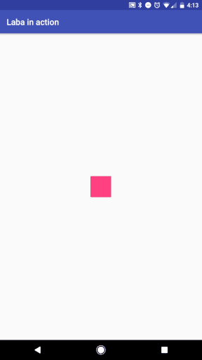
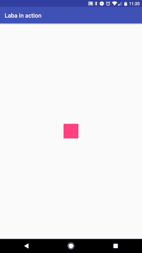
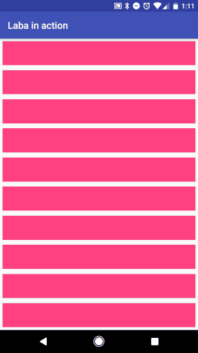
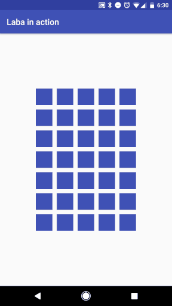

# [Laba](https://github.com/kittyMac/laba)
This project is the Android implementation of [Laba](https://github.com/kittyMac/laba), go there to see the documentation and more information about Laba. Only Android specific details are going to be found here.

## Details
* This implementation was developed using [**Kotlin 1.1.2-4**](https://kotlinlang.org/)
* The [Animators](https://developer.android.com/reference/android/animation/Animator.html) API is used to implement Laba. 
* All the screen units used as parameters for operators are going to be interpreted as [**dp**](https://developer.android.com/guide/practices/screens_support.html#dips-pels)
*  `l` operator is going to perform a reverse loop instead of a relative loop.
*  Android SDK Version: 19+

#### Interpolators

Available builtin interpolators and their indexes:

* `LinearInterpolator`                   - 0
* `LinearOutSlowInInterpolator`          - 1
* `FastOutLinearInInterpolator`          - 2
* `FastOutSlowInInterpolator`            - 3
* `AccelerateInterpolator`               - 4
* `DecelerateInterpolator`               - 5
* `AccelerateDecelerateInterpolator`     - 6
* `AnticipateInterpolator`               - 7
* `OvershootInterpolator`                - 8
* `AnticipateOvershootInterpolator`      - 9
* `BounceInterpolator`.                  - 10

## Examples

#### 1- Move and Rotation sample

~~~kotlin
targetPink.laba("D1^80|>80|v160|<160|^160|>80|v80|r")
~~~

#### 2- Using duration and negation operator
~~~kotlin
targetPink.laba("^100e11D1d1|c5e1d0.25|C5e1d0.25|D0.5s3f0!p30^100")
~~~

#### 3- Animating more than one element
~~~kotlin
for (index in 0..container.childCount - 1) {
    container.getChildAt(index).laba("pD${1 + 0.25f*index}d1|>1000e7d1")
}
~~~

#### 4- More complex animations

All the examples seen above can be found in the **labainaction** module.

## Extending Laba

Laba can be extended by adding more operators or interpolators. Below are some examples.

* Operators extension

	~~~kotlin
	LabaNotation.addLabaOperator {
        symbol = "c" //Symbol for this operator
        animator = { //Animator implementation for this operator
            view, param, invert ->
            val localParam = if (invert) 1 / (param ?: defaultParam) else (param ?: defaultParam)
	
            val originalScale: Float by lazy { view.scaleX }
            val toScaleX: Float by lazy { originalScale - localParam }
	
            val animator = ValueAnimator.ofFloat(0f, 1f)
            animator.addUpdateListener {
                animation ->
                view.scaleX = originalScale - toScaleX * animation.animatedValue as Float
            }
            animator
        }
        describe = { //function that appends the description of this operator to a StringBuilder
            sb, _, param, invert ->
            if (!invert)
                sb.append("scale x to ${(param ?: defaultParam) * 100}%, ")
            else
                sb.append("scale x to ${((1 / (param ?: defaultParam)) * 100)}%, ")
        }
        defaultParam = 1f //Default param for this operator
    }
	 
	//Use of this new operator
	view.laba("<100c2")
	~~~
* Interpolators extension

	~~~kotlin
	val index = LabaNotation.addInterpolator(TimeInterpolator { input ->
        val x = 2.0f * input - 1.0f
        0.5f * (x * x * x + 1.0f)
    })
	    
	//Use of this new interpolator
	view.laba("<100e$index|r")
	~~~

## Install

**Gradle**

~~~groovy
compile 'com.smallplanet:labalib:0.1'

//Need to add this source to repositories
maven { url  "http://dl.bintray.com/firstrage/android" }
~~~

**Mave**

~~~xml
<dependency>
  <groupId>com.smallplanet</groupId>
  <artifactId>labalib</artifactId>
  <version>0.1</version>
  <type>pom</type>
</dependency>
~~~

## License

Laba is free software distributed under the terms of the MIT license, reproduced below. Laba may be used for any purpose, including commercial purposes, at absolutely no cost. No paperwork, no royalties, no GNU-like "copyleft" restrictions. Just download and enjoy.

Copyright (c) 2017 [Small Planet Digital, LLC](http://smallplanet.com)

Permission is hereby granted, free of charge, to any person obtaining a copy of this software and associated documentation files (the "Software"), to deal in the Software without restriction, including without limitation the rights to use, copy, modify, merge, publish, distribute, sublicense, and/or sell copies of the Software, and to permit persons to whom the Software is furnished to do so, subject to the following conditions:

The above copyright notice and this permission notice shall be included in all copies or substantial portions of the Software.

THE SOFTWARE IS PROVIDED "AS IS", WITHOUT WARRANTY OF ANY KIND, EXPRESS OR IMPLIED, INCLUDING BUT NOT LIMITED TO THE WARRANTIES OF MERCHANTABILITY, FITNESS FOR A PARTICULAR PURPOSE AND NONINFRINGEMENT. IN NO EVENT SHALL THE AUTHORS OR COPYRIGHT HOLDERS BE LIABLE FOR ANY CLAIM, DAMAGES OR OTHER LIABILITY, WHETHER IN AN ACTION OF CONTRACT, TORT OR OTHERWISE, ARISING FROM, OUT OF OR IN CONNECTION WITH THE SOFTWARE OR THE USE OR OTHER DEALINGS IN THE SOFTWARE.
